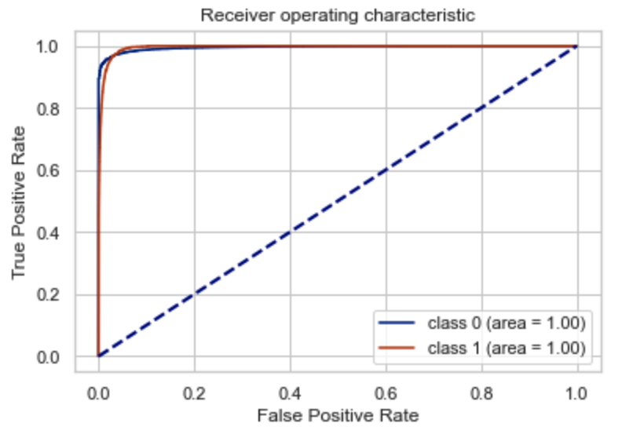
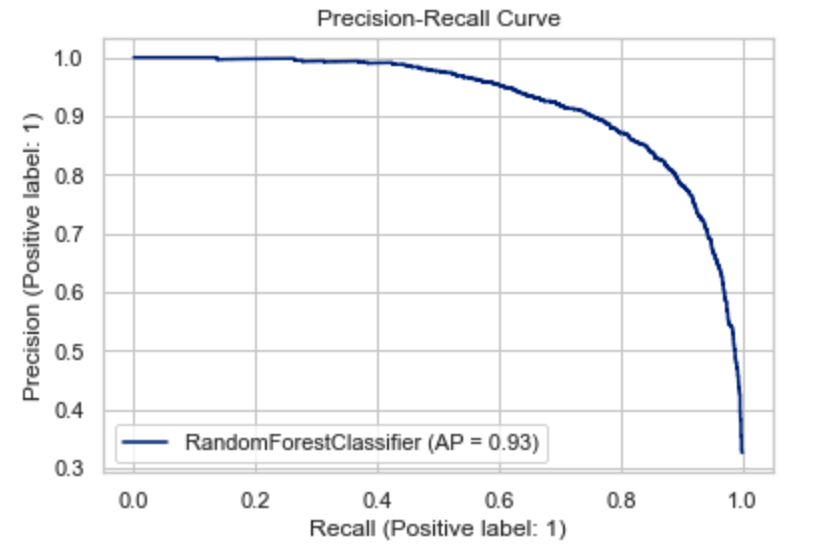
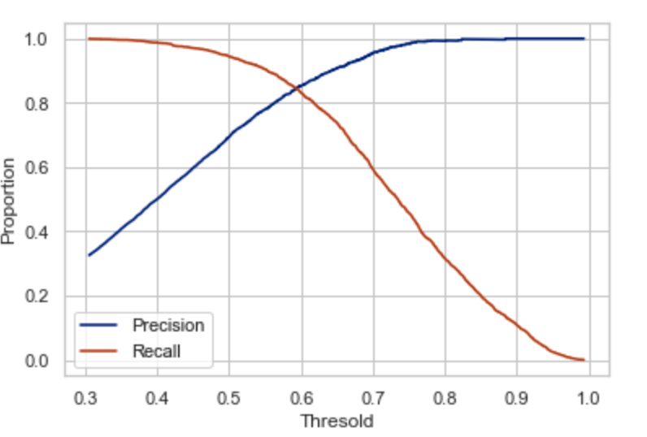
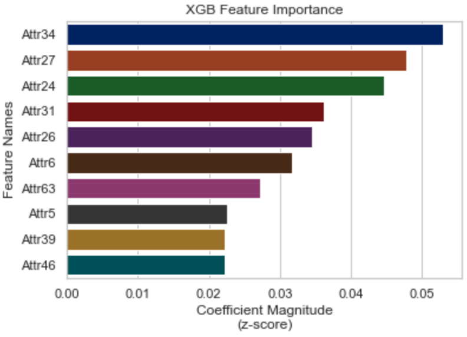
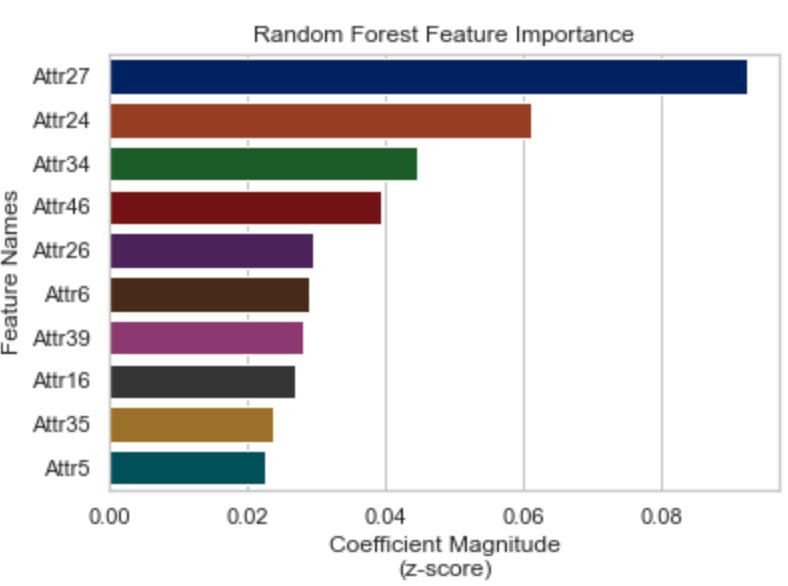

# Abstract

The objective of this study is to find if a company will bankrupt or
not. The data is heavily skewed towards companies that do not bankrupt
as only some of the companies go bankrupt. The risk in creating this
model is it will have an accuracy of over 95% but may still fail to
predict when the company is going bankrupt as the data doesn't have a
lot of information about companies that went bankrupt. In this study,
the objective is to find out with good accuracy and precision if a
company may go bankrupt.

# Introduction

The dataset consists of five files, one file for each year. Each file
contains 64 attributes labeled as Attr1 through Attr64. All attributes
are numerical except for the target variable which is a string and
classifies if the company was bankrupt or not. The target feature is a
string, but it is changed to 0 (non-bankrupt) and 1 (bankrupt).

  -----------------------------------------------------------------------
  Attribute Name Description
  -------------- --------------------------------------------------------
  X1             net profit / total assets

  X2             total liabilities / total assets

  X3             working capital / total assets

  X4             current assets / short-term liabilities

  X5             \[(cash + short-term securities + receivables -
                 short-term liabilities) / (operating expenses -
                 depreciation)\] \* 365

  X6             retained earnings / total assets

  X7             EBIT / total assets

  X8             book value of equity / total liabilities

  X9             sales / total assets

  X10            equity / total assets

  X11            (gross profit + extraordinary items + financial
                 expenses) / total assets

  X12            gross profit / short-term liabilities

  X13            (gross profit + depreciation) / sales

  X14            (gross profit + interest) / total assets

  X15            (total liabilities \* 365) / (gross profit +
                 depreciation)

  X16            (gross profit + depreciation) / total liabilities

  X17            total assets / total liabilities

  X18            gross profit / total assets

  X19            gross profit / sales

  X20            (inventory \* 365) / sales

  X21            sales (n) / sales (n-1)

  X22            profit on operating activities / total assets

  X23            net profit / sales

  X24            gross profit (in 3 years) / total assets

  X25            (equity - share capital) / total assets

  X26            (net profit + depreciation) / total liabilities

  X27            profit on operating activities / financial expenses

  X28            working capital / fixed assets

  X29            logarithm of total assets

  X30            (total liabilities - cash) / sales

  X31            (gross profit + interest) / sales

  X32            (current liabilities \* 365) / cost of products sold

  X33            operating expenses / short-term liabilities

  X34            operating expenses / total liabilities

  X35            profit on sales / total assets

  X36            total sales / total assets

  X37            (current assets - inventories) / long-term liabilities

  X38            constant capital / total assets

  X39            profit on sales / sales

  X40            (current assets - inventory - receivables) / short-term
                 liabilities

  X41            total liabilities / ((profit on operating activities +
                 depreciation) \* (12/365))

  X42            profit on operating activities / sales

  X43            rotation receivables + inventory turnover in days

  X44            (receivables \* 365) / sales

  X45            net profit / inventory

  X46            (current assets - inventory) / short-term liabilities

  X47            (inventory \* 365) / cost of products sold

  X48            EBITDA (profit on operating activities - depreciation) /
                 total assets

  X49            EBITDA (profit on operating activities - depreciation) /
                 sales

  X50            current assets / total liabilities

  X51            short-term liabilities / total assets

  X52            (short-term liabilities \* 365) / cost of products sold)

  X53            equity / fixed assets

  X54            constant capital / fixed assets

  X55            working capital

  X56            (sales - cost of products sold) / sales

  X57            (current assets - inventory - short-term liabilities) /
                 (sales - gross profit - depreciation)

  X58            total costs /total sales

  X59            long-term liabilities / equity

  X60            sales / inventory

  X61            sales / receivables

  X62            (short-term liabilities \*365) / sales

  X63            sales / short-term liabilities

  X64            sales / fixed assets
  -----------------------------------------------------------------------

  : Table 1 : Attributes and Description

*Reference:
https://archive.ics.uci.edu/ml/datasets/Polish+companies+bankruptcy+data*

# Data Analysis

There were 41322 values that were missing or null. Below table lists the
number of values missing in the data set with their percentages for top
5 (in terms of missing data) attribute.

  -----------------------------------------------------------------------
  Column                  Null Values         Null Value By %
  ----------------------- ------------------- ---------------------------
  Attr37                  18984               43.73 %

  Attr21                  5854                13.48 %

  Attr27                  2764                6.36 %

  Attr60                  2152                4.95 %

  Attr45                  2147                4.94 %
  -----------------------------------------------------------------------

  : Table 2: Missing Values

To decide the most appropriate way to impute the missing data.
Additional analysis on the data is required.

The data distribution of top 5 attributes missing data is listed below:

  ---------------------------------------------------------------------------
           Attr37       Attr21       Attr27        Attr60        Attr45
  -------- ------------ ------------ ------------- ------------- ------------
  count    24421        37551        4.06E+04      4.13E+04      41258

  mean     105.08       3.88         1.11E+03      4.48E+02      14.82

  std      3058.42      228.66       3.50E+04      3.23E+04      2428.23

  min      -525.52      -1325        -2.59E+05     -1.24E+01     -256230

  25%      1.14         0.90         4.50E-02      5.55E+00      0.02

  50%      3.09         1.04         1.08E+00      9.79E+00      0.28

  75%      11.41        1.20         5.14E+00      2.02E+01      0.95

  max      398920       29907        4.21E+06      4.82E+06      366030
  ---------------------------------------------------------------------------

  : Table 3: Data distribution of Attributes

The above distribution of data shows that the standard deviation is very
high for all of the top missing attributes. This shows that the taking a
mean to impute the missing values may not be appropriate as the
deviation between minimum and maximum values is very high and will skew
the mean of the variables. Upon further analysis it was determined that
the organizations which were bankrupt has much higher values in some of
these attributes skewing the data further. There are significant
outliers in the data, and it is appropriate to use the median values
instead to impute the missing data considering the data at 50% and even
at 75% distribution is much smaller than the actual mean. This analysis
applies median for all missing values, as all columns that were missing
data show the similar characteristics.

### Violin plot for Missing Data Columns

{width="2.9076476377952756in"
height="2.0637390638670166in"}

Figure 1:Violin plot shows extreme variations of data distribution

{width="6.934495844269466in"
height="7.286406386701662in"}

Figure 2:Colliniarity heatmap of Attributes

Data shows there is high collinearity for few of the attributes and this
is expected, as many of the features are calculated based of other
variables (mathematical formulae). In this analysis none of the
attribute are dropped and study considers all the columns for data
analysis and modeling.

### 

### Target

Target is a binary classification of whether the company went bankrupt
or not. Note that most companies don't go bankrupt, so the data is
heavily skewed. From the target variable distribution, we can see that
only around 5% of the companies ended up filing bankruptcy. so, the
dataset is imbalanced. Accuracy would not be the right metric since we
have imbalanced data. The cost of False Negative would be high, and
Recall would be right metric to evaluate models. F-score which gives a
balance between precision and recall can also be used as other metric

+--------------------------------------+-------------------------------+
| {width="3.4954429133858267in" |                               |
| height="2.302742782152231in"}        |                               |
|                                      |                               |
| Figure 3: Target Distribution        |                               |
+======================================+===============================+
+--------------------------------------+-------------------------------+

: Table 4: Classification Matrix comparison of RF and XGBoost

# 2. Methods

## Classification Models

This study uses random forest with a number of parameters to check the
best set of parameters and compare the model to XGBoost with also a
variety of parameters to see which model performs better.

Model evaluation metrics would be accuracy, precision and recall. In the
case of Bankruptcy, if the model fails to predict the False Negative
correctly that means the financial institute continue to service the
companies that will go bankrupt this will be the more severe outcome as
the bank may lose a large financial investment, compared to predicting a
false positive which would make the bank closely monitor a company that
would most likely not go bankrupt.

Due to the imbalanced nature of the minority class in the data set we
implemented a stratified shuffle to ensure each fold in cross validation
is representative of the distribution for samples of the original data
set.

### Random Forest Classification

Random forest is an ensemble tree-based learning algorithm where it
combines more than one algorithm of the same or different kinds for
classifying objects. The Random Forest Classifier is a set of decision
trees from a randomly selected subset of the training set. It aggregates
the votes from different decision trees to decide the final class of the
test object.

#### Parameters:

\- n_estimators: number of trees in the forest

\- max_depth: max number of levels in each decision tree

\- criterion: The function to measure the quality of a split. Supported
criteria are *gini* for the Gini impurity and *entropy* for the
information gain. Note: this parameter is tree-specific

\- min_samples_split = min number of data points placed in a node before
the node is split

\- *min_samples_leaf* = min number of data points allowed in a leaf node

\- *class_weight*: The *balanced* mode uses the values of y to
automatically adjust weights inversely proportional to class frequencies
in the input data as

a.  n_samples / (n_classes \* np.bincount(y))

This study compares two models, Random Forest Classification and
XGBoost. Random Forest is the basic unsupervised method to classify
using Entropy/Gini. In theory, Random Forest gives a benchmark upon
which any sufficient advanced algorithm must beat. In general, any
algorithm that is using deep learning principles must have a better
outcome than Random Forest.

### XGBoost

XGBoost stands for eXtreme Gradient Boosting, which provides a gradient
boosting, and often achieves higher accuracy simple Decision Trees, but
at a cost of simple interpretability, as XGBoost follows paths of
hundreds or thousands of trees, makes it harder to interpret, but
provides an accuracy boost.

The hyper-parameters (tunable parameters) are:

\- *learning_rate*: The learning rate. In each boosting step, this value
shrinks the weight of new features, preventing overfitting or a local
minimum. This value must be between 0 and 1. The default value is 0.3.

\- *max_depth*: The maximum depth of a tree. Be careful, greater the
depth, greater the complexity of the model, and easier to overfit. This
value must be an integer greater than 0 and have 6 as default.

\- *n_estimators*: The number of trees in ensemble.

\- *gamma*: A regularization term and it's related to the complexity of
the model. It's the minimum loss necessary to occur a - -split in a
leaf. It can be any value greater than zero and has a default value of
0.

\- *colsample_bytree*: Represents the fraction of columns to be
subsampled. It's related to the speed of the algorithm and preventing
overfitting. The default value is 1 but it can be any number between 0
and 1.

\- *lambda*: L2 regularization on the weights. This encourages smaller
weights. Default is 1 but it can be any value.

#### Randomized Search

Since *GridSearch* method is performance intensive for *Random Forest*
and *XGBoost*. This study uses Randomized search option to find the most
optimum model of the dataset.

##### Random Forest:

For *Random Forest* below hyper tuning parameters were used:

*max_depth = \[5, 7, 8, 10, 12\]*

*n_estimators = \[200\]*

*criterion = \[\'entropy\'\]*

*min_samples_leaf = \[3, 4, 5\]*

*min_samples_split = \[8, 10, 12\]*

*class_weight = \[\'balanced\'\]*

##### XGBoost:

For *XGBoost* below hyper tuning parameters were used:

*n_estimators = \[200\]*

*learning_rate = \[0.0001, 0.001, 0.01, 0.1, 0.2, 0.3, 0.4, 0.5\]*

*max_depth = range (3, 15)*

*colsample_bytree = \[i/10.0 for i in range (1, 3)\]*

*gamma = \[0.01, 0.05, 0.1, 0.2, 0.3\]*

*reg_lambda = \[0.01, 0.05, 0.1, 1.0, 5.0, 10.0, 50.0, 100.0\]*

*min_child_weight = \[0.1, 0.9, 0.95,1, 2, 3\]*

# 3. Results

The two models *Random Forest* and *XGBoost* were computed on the given
data. Both models produce high precision results. The *Random Forest*
model produces the highest accuracy of 95% while *XGBoost* produces the
highest accuracy of 97.4%.

##### Best Random Forest Model:

Below parameters produced the best *Random Forest* model:

*max_depth = \[12\]*

*n_estimators = \[200\]*

*criterion = \[\'entropy\'\]*

*min_samples_leaf = \[4\]*

*min_samples_split = \[8\]*

*class_weight = \[\'balanced\'\]*

##### Best XGBoost Model:

Below parameters produced the best XGBoost model:

*n_estimators = \[200\]*

*learning_rate = \[0.5\]*

*max_depth = \[6\]*

*colsample_bytree = \[0.2\]*

*gamma = \[ 0.05\]*

*reg_lambda = \[10\]*

*min_child_weight = \[1\]*

Both the models with the parameters listed above were executed with
Cross Validation of 10.

The detailed results from both the models are listed below:

  -----------------------------------------------------------------------
  Metric                       XGBoost          Random Forest
  ---------------------------- ---------------- -------------------------
  *Best Accuracy*              *0.97*           *0.95*

  *F-Score*                    *0.69*           *0.54*

  *Precision*                  *0.92*           *0.53*

  *Recall*                     *0.57*           *0.56*
  -----------------------------------------------------------------------

  : Table 5: Comparison of RF and XGBoost

  ------------------------------------------------------------------------------------------------------
  XGBoost                                                       Random Forest
  ------------------------------------------------------------- ----------------------------------------
  {width="3.57in"
  generated](./media/image4.png){width="3.7139096675415573in"   height="2.44in"}
  height="2.5957731846019247in"}                                

  {width="3.57in"
  confidence](./media/image6.png){width="3.57in"                height="2.48in"}
  height="2.49in"}                                              

  {width="3.57in"
  generated](./media/image8.png){width="3.57in"                 height="2.41in"}
  height="2.49in"}                                              
  ------------------------------------------------------------------------------------------------------

  : Table 6: Features Importance from RF and XGBoost

#  4. Conclusion

XGBoost and Random Forest produces high accuracy results for the dataset
provided. XGBoost gives a model with higher accuracy compared to that of
Random Forest. Top 10 attributes in terms of feature importance from
both models are listed below:

  --------------------------------------------------------------------------------------
  XGBoost                                         Random Forest                       
  --------------- ------------------- ----------- --------------- ------------------- --
  Feature Name    **Coefficient       **Feature                   **Coefficient       
                  Weights**           Name**                      Weights**           

  *Attr34*        *0.053017*          *Attr27*                    *0.092498*          

  *Attr27*        *0.047856*          *Attr24*                    *0.061082*          

  *Attr24*        *0.044652*          *Attr34*                    *0.04467*           

  *Attr31*        *0.036197*          *Attr46*                    *0.039253*          

  *Attr26*        *0.03458*           *Attr26*                    *0.029613*          

  *Attr6*         *0.031737*          *Attr6*                     *0.028936*          

  *Attr63*        *0.027181*          *Attr39*                    *0.028045*          

  *Attr5*         *0.022615*          *Attr16*                    *0.026946*          

  *Attr39*        *0.022301*          *Attr35*                    *0.023761*          

  *Attr46*        *0.022255*          *Attr5*                     *0.022659*          

  *Attr19*        *0.020986*          *Attr13*                    *0.022149*          

  *Attr22*        *0.02077*           *Attr42*                    *0.021406*          

  *Attr13*        *0.019001*          *Attr27*                    *0.092498*          

  *Attr30*        *0.018951*          *Attr24*                    *0.061082*          
  --------------------------------------------------------------------------------------

+-----------------------------------------------------------------------+
| +-----------------------------------------------+-----------------+   |
| | {width="4.43in"       |                 |   |
| | height="3.2in"}                               |                 |   |
| |                                               |                 |   |
| | {width="4.43in"       |                 |   |
| | height="3.29in"}                              |                 |   |
| +===============================================+=================+   |
| +-----------------------------------------------+-----------------+   |
|                                                                       |
| Figure 6-Feature Importance of top 10 Attributes XGBoost (Above) and  |
| Random Forest (Below)                                                 |
+-----------------------------------------------------------------------+

The above table displays the features with their coefficient levels.
These are the top 10 coefficients after the L2 penalty.

*Attributes 27* and *24* are the topmost features in terms of importance
from both the models. As per the description these attributes are the
profit of the organization. It makes sense that profit plays a very high
role in predicting if an organization may go bankrupt in the near future
or not. The model has accurately identified the important features.

  -----------------------------------------------------------------------
  Attribute      Description
  -------------- --------------------------------------------------------
  *X24*          gross profit (in 3 years) / total assets

  *X27*          profit on operating activities / financial expenses
  -----------------------------------------------------------------------

Since *XGBoost* has higher accuracy and F-score, it's the recommended
model based on the analysis in this study.

The precision in this model for our target clients that went bankrupt
(target 1), tells that out of the predicted values how many were
correct. In this model it tells the number of false positives. This
represents when a company did not go bankrupt, but the model predicted
that they had gone bankrupt. This is assumed to be less severe since the
bank will most likely just pay closer attention to this company which is
not a major loss in investment. The best model is XGBoost with 92%
precision which is just much better than the Random Forest that has just
53% precision.

The best model is the XGBoost this is because it is the best in
predicting the critical metric of recall for the target 1. The random
forest performed with 56% of the recall being correct, XGBoost was the
best with 57% correct recall. While this was the best compared to the
other models it still leaves a lot of room for improvement in prediction
capabilities.

# Appendix -- Code

NB Viewer Link:

*https://nbviewer.org/github/ravisiv/CS4_BankruptcyClassificationXGBoost/blob/main/CaseStudy4.ipynb*
